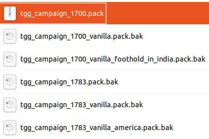

# Foothold in India: The Great Game


---

# Introduction

> **Term definition:**
>
> [**The Great Game**](https://en.wikipedia.org/wiki/Great_Game) was a rivalry between the 19th century British and Russian Empires over influence in Asia, primarily in Afghanistan, Persia, and later Tibet. The two colonial empires used military interventions and diplomatic negotiations to acquire and redefine territories in Central and South Asia. By the early 20th century, a line of independent states, tribes, and monarchies from the shore of the Caspian Sea to the Eastern Himalayas were made into protectorates and territories of the two empires.

Foothold in India is a light overhaul modification, addressing the problems of vanilla Empire while staying true to its spirit.

It is a modular project, with all `.pack` files acting as independent modules that can be applied in any combination with each other or as standalone modifications.

The mod is designed to run on **MacOS**, **Linux** and **Windows**.

### [ModDB page](https://www.moddb.com/mods/foothold-in-india)

### [TWCenter thread](https://www.twcenter.net/forums/showthread.php?818118-Foothold-in-India-The-Great-Game)

---

# Foothold in India 1.4.7

Save-game compatible with all versions starting with 1.2.

**ATTENTION:** Please delete all other mods and all files from the previous version prior to installation, unless you absolutely know what you're doing.

---

# Installation


To install, simply put everything into `Empire Total War` installation folder (make a backup of `sounds_sfx.pack` in `data` folder - the only vanilla file overwritten in the process).

The mod is split into numerous small mods, represented by `.pack` files. All `.pack`-s are in movie format and are specifically designed to not have any conflicts with each other, so you don’t need to maintain a `user.empire_script.txt`. You can find detailed description of each file in the following chapter.

To deactivate a specific `.pack`, simply add a `.bak` extension to its name. If you are unsure whether you want to have a certain mod on or off, you can add and remove the `.bak` extension to activate/deactivate it instead of removing the file.

**You should always keep tgg_base `.pack` active:**

**tgg_base** does nothing on its own, but provides necessary dependencies and localisation strings for the other mods.

Despite my best efforts to keep the packages minimally invasive, **compatibility with mods not included in Foothold in India is not guaranteed**.

Take note, that some mods \[for instance, **tgg_battle_groupformations_darth** and **tgg_battle_groupformations_sinuhet**\] are different versions or options of the same change, and should not be active together at the same time.

---

\clearpage

Same logic applies when choosing a campaign to play. You have 6 different options, which will be described in more detail in the next chapters of the README:

- **tgg_campaign_1700** (recommended; 1700 The Great Game campaign with numerous changes)
- **tgg_campaign_1700_vanilla** (1700 vanilla with all factions unlocked)
- **tgg_campaign_1700_vanilla_foothold_in_india** (1700 vanilla with Britain and France having regions in India)
- **tgg_campaign_1783** (recommended; 1783 The Great Game campaign with numerous changes)
- **tgg_campaign_1783_vanilla** (1783 vanilla with all factions unlocked)
- **tgg_campaign_1783_vanilla_america** (vanilla Warpath campaign with all factions unlocked)

To activate a campaign, you need to keep one of the 6 campaign `.pack` files active, **only one at a time**.



On the screen above you can see me activating **tgg_campaign_1700**, while keeping the other campaigns deactivated by adding `.bak` extension to the `.pack's` names. Activating several different campaigns simultaneously could produce conflicts and bugs, so please keep careful watch on the campaign files you activate.

> **Author’s note:**
>
> If you wish to experience Foothold in India as the author intended it to be, you should simply put all the files from the archive into `Empire Total War/data` without activating or deactivating any of them. Afterward, you will be able to understand which parts you would like to tweak and activate or deactivate certain packages to your taste.

## Scripting options

Aside from switching the `.pack`-s on and off, you have several scripting options available in `scripting.lua`. In order to activate these options, you should navigate to `Empire Total War/data/campaigns/The_Campaign_You_Decided_To_Activate` and edit `scripting.lua` as follows:

### Reducing AI aggression towards player and player's protectorates

The AI in ETW is set to behave more aggressively towards the player and his protectorates by default. This makes the game more hardcore, and, in my opinion, is not a bad thing, taking into consideration the inherent limitations of the game's AI. If you wish to make the AI treat you similarly to all the other factions in the campaign, open `scripting.lua` and un-comment \[remove `--` at the beginning of\] the following lines:

```lua
-- scripting.game_interface:set_campaign_ai_force_all_factions_boardering_humans_to_have_invasion_behaviour(false)
-- scripting.game_interface:set_campaign_ai_force_all_factions_boardering_human_protectorates_to_have_invasion_behaviour(false)
```

Should become simply:

```lua
scripting.game_interface:set_campaign_ai_force_all_factions_boardering_humans_to_have_invasion_behaviour(false)
scripting.game_interface:set_campaign_ai_force_all_factions_boardering_human_protectorates_to_have_invasion_behaviour(false)
```

If you wish to deactivate the option, simply comment the lines again \[put `--` at the beginning of the lines\].

### Removing fog of war

If you wish to play without fog of war, un-comment (remove `-- `) the following line:

```lua
-- scripting.game_interface:show_shroud(false)
```

Should become simply:

```lua
scripting.game_interface:show_shroud(false)
```

---

# The mods


## Base:

- **tgg_base**: This pack changes nothing on its own, but provides necessary dependencies and localization strings for all other packs and startpos files. **Always keep this pack active.** If you only use this pack and nothing else, you will technically still be playing vanilla Empire.

## Patches:

- **tgg_patch6**: A conservative community bug-fix compilation. The most notorious bug is the overpowered Galleon cannon. Fixing it reduces Galleon’s firepower from 370 to 122 \[sic!\].
- **tgg_patch_town_wealth**: Fixes town wealth growth in provinces with ports. The pack seems to be buggy [(more details in TWCenter thread)](https://www.twcenter.net/forums/showthread.php?685133-The-big-town-wealth-bug-Fixed!-Patch-mod). To activate, remove the `.bak` extension.


## Campaign mechanics:

- **tgg_campaign_ai_darth**: Campaign AI adjustments from Darth Mod. To activate, remove the `.bak` extension. **IMPORTANT: Use only one of the tgg_campaign_ai_\* packs, but not several at a time.**
- **tgg_campaign_ai_mfr**: My own AI adjustments in the style of Minor Factions Revenge. The AI is generally more helpful towards allies and has a bit more incentive towards maritime expansion. One of the highlights is that the AI recruits generals more frequently. Another is making Eastern factions much more reliant on cavalry.
- **tgg_campaign_ai_succession**: My own AI adjustments in the style of Succession - A Total War: Empire Revival Mod. The AI is more cautious and less prone to foolish actions. To activate, remove the `.bak` extension. EXPERIMENTAL: not really tested that much yet.
- **tgg_campaign_difficulty_darth**: Darth Mod system of difficulty settings. Removes most buffs for AI on various difficulty levels. The AI now won’t have more recruitment slots in their cities than the player, the AI’s units won’t go further distances on the campaign map, etc. The only things left that change with difficulty level are: speed of research, income and upkeep costs.
- **tgg_campaign_diplomacy_twc**: TWCenter forums "hush"-style diplomacy attitudes, with penalties for going to war, annexing, assassinating, etc. quickly going back to normal.
- **tgg_campaign_mechanics_mfr**: Campaign variables in the style of Minor Factions Revenge. The impact of generals rank on autoresolve outcomes is considerably lowered. Autoresolve is generally more fair. Tax inefficiency kicks in faster, the more territories a faction conquers.
- **tgg_campaign_no_city_forts**: Shokh Hates Sieges by Shokh. Disables city fortification construction.
- **tgg_campaign_sikh_temple**: Gives Punjab a religious building (but not an agent).
- **tgg_campaign_tech_tree**: A more straightforward military tech tree taken from Empire Reborn 3.0. Fire by rank is reachable faster. Cavalry tech, infantry tech and bayonet drills constitute more independent tracks than they do in vanilla. AI seems to navigate this tree better than vanilla.


## Battle mechanics:

- **tgg_battle_environments**: Smaller cities and less resilient buildings during battles.
- **tgg_battle_groupformations_darth**: Darth’s group formations. Replaces Sinuhet’s. In comparison to Sinuhet’s group formations, Darth’s seem to be more cautious and less aggressive, but also less buggy and more polished. **IMPORTANT: Use only one of the tgg_battle_groupformations_\* packs, but not several at a time.**
- **tgg_battle_groupformations_sinuhet**: Sinuhet’s group formations. I personally prefer Darth’s. To activate, remove the `.bak` extension.
- **tgg_battle_increased_misfire**: Increases matchlock muskets misfire chance from zero to 16%, and flintlock muskets from zero to 12%.
- **tgg_battle_mechanics_darth**: Battle mechanics from Darth Mod. To activate, remove the `.bak` extension. **IMPORTANT: Use only one of the tgg_battle_mechanics_\* packs, but not several at a time.**
- **tgg_battle_mechanics_mfr**: Battle mechanics from Minor Factions Revenge.
- **tgg_battle_mechanics_napoleon**: Battle mechanics from Napoleon Total War. To activate, remove the `.bak` extension.
- **tgg_battle_triggers**: Bran’s events triggers. These should theoretically improve AI’s response to certain events during battles, such as flanking attacks, encirclement etc. However, in vanilla, for some reasons, these triggers were disabled. EXPERIMENTAL. Use at your own risk. To activate, remove the `.bak` extension.
- **tgg_battle_unit_specs_eastern_firing_drills**: Gives access to European firing drills to pre-modern eastern lines, such as Janissaries, Jazayerchis, Qizilbashi, Bargir and Sikh Musketeers. I personally consider disabling firing drills a good design, which makes gameplay for Eastern factions more challenging. The pack is disabled by default. To activate, remove the `.bak` extension.
- **tgg_battle_unit_specs_guns_expensive**: Increases most artillery recruitment and upkeep costs by a multiplier of around 1.3-1.4. Somewhat similar to Napoleon Total War.
- **tgg_battle_unit_stats_darth**: Ports unit stats and sizes from Darth Mod. To activate, remove the `.bak` extension. **IMPORTANT: Use only one of the tgg_battle_unit_stats_\* packs, but not several at a time.**
- **tgg_battle_unit_stats_more_grenadiers_lights**: Matchlock-armed peasant units and foot archers are now up to 160 men. Grenadiers, light infantry and skirmishers are up to 120. Camel troops are up to 80. Somewhat similar to Napoleon Total War. To activate, remove the `.bak` extension.
- **tgg_battle_unit_stats_tight**: The default Foothold in India unit stats pack. Same as "more grenadiers and lights", with tighter unit formations. Line infantry, grenadiers, pikemen, melee janissaries and all cavalry except the ones shooting from horseback now move in closer formations. This allows the line infantry to hold better against cavalry charges, while giving cavalry more of a punch. Cavalry is now more dangerous for loosely formed units, while skirmishers are now more dangerous for tightly-packed line. All in all, this increases the "rock paper scissors" dynamics between the troop types.


## Unit packs:

- **tgg_unitpack_anatolian_janissaries**: Gives elite Anatolian Janissaries to Ottomans. Recruitment is only possible in Anatolia and is limited to 4 units.
- **tgg_unitpack_anatolian_janissaries_for_kupa**: Gives Ottomans an even stronger version of Anatolian Janissaries, surpassing almost every European elites in melee, but lagging behind in drills and formations. Recruitment is only possible in Anatolia and is limited to 6 units. To activate, remove the `.bak` extension. Use either this or **tgg_unitpack_anatolian_janissaries**, but not both.
- **tgg_unitpack_caucasus**: Redesigns troop rosters of Crimean Khanate, Georgia and Dagestan to resemble Morocco and Barbary States (read more below).
- **tgg_unitpack_caucasus_for_guest**: Same as the above, but without disabling vanilla units, only adding the new ones. I personally recommend strongly against using this pack, however, due to a request from the community, I’m including it as well. To activate, remove the `.bak` extension. Use either this or the above, but not both.
- **tgg_unitpack_fleets_of_india**: Complete redesign of early Indian and Persian navies. The factions now start with Barbary-style fleets, which evolve into proper European fleets with technological progress. This leaves the Ottomans and Mamluk States as the only factions with European-style ships right from the early development stages.
- **tgg_unitpack_guns_of_caucasus**: Enables cannons for Georgia, Dagestan and Crimean Khanate. I personally recommend against using this pack. However, due to numerous requests from the community, I provide it to you. To activate, remove the `.bak` extension.
- **tgg_unitpack_guns_of_caucasus_for_mersechal**: Enables cannons only for Georgia (which is historically correct). I personally recommend against using this pack. However, due to the request from Mersechal, a person who provided me a lot of invaluable historical consulting, I provide it to you. To activate, remove the `.bak` extension.
- **tgg_unitpack_guns_of_maghreb**: Enables cannons for Morocco and Barbary States. I personally recommend against using this pack. However, due to numerous requests from the community, I provide it to you. To activate, remove the `.bak` extension.
- **tgg_unitpack_guns_of_the_west**: Allows making European sakers in Minor Governor’s Encampment, Barracks and Minor Royal Palace.
- **tgg_unitpack_india**: Gives Mughals Islamic Musketeers (Hindu regions are not common in Mughal lands in vanilla). Gives Mysore Islamic Musketeers and Hindu Warriors (Islamic units are not recruitable in Mysore region in vanilla). Makes Qizilbashi Cavalry and Dervishes recruitable globally (like Qizilbashi Musketeers), unlocking them for Persia. Makes Native Lancers accessible faster, and Sikh Musketeers accessible slower. Unlocks Zamburak Camel Gunners in custom battles for all Indian factions and Persia. All in all, this pack addresses the wild inequality of Indian factions.
- **tgg_unitpack_indian_horse_generals**: Replaces Indian General's Bodyguard elephants with horses. Elephant generals mess up the autocalc, but in my opinion they're too fun to play with. To activate, remove the `.bak` extension.
- **tgg_unitpack_maghreb**: Gives Morocco and Barbary States swordsmen and proper cavalry.
- **tgg_unitpack_nerf_bargir**: Makes Bargir Infantry poorly trained and undisciplined, using matchlocks instead of flintlocks, and only recruitable in major multislot cities, starting with Drill School (read more below).
- **tgg_unitpack_nerf_galleon**: Galleons can now be recruited only starting from Dockyard and Commercial Port, effectively preventing Spain and pirates to spam them until the necessary facilities are constructed.


- **tgg_unitpack_ottoman**: Increases Mamluks unit size to 80, improves their training and makes them accessible faster, giving Ottomans a cavalry unit accessible right from the start. Also, they don’t disband after a revolution because the Ottomans don’t have any good alternatives to using them as light/medium cavalry. Increases Circassian Armoured Cavalry upkeep. Gives Ottomans and Mamluk States Deli Lancers. Gives Mamluk States Fellahin Swordsmen and Musketeers.
- **tgg_unitpack_pirates**: Gives Carribean and Barbary land pirate units grenades and a pistol with one ammo to shoot before making a charge. Allows Barbary States access Xebecs faster. Adds stronger units to Barbary States and Pirates city garrisons. Try starting as Spain and taking the "unprotected" Algiers on turn 1, and you are in for a nasty surprise.
- **tgg_unitpack_russian_line_suvorov**: Buffs Russian Line Infantry, improving their training and shooting skills. This pack brings Russian line to European standards both in price and training \[and to its historical peak effectiveness level reached by mid-to-late 18th century\], making them a unit with slightly worse reloading and defense skills, but with good attack and charge stats. Best applied together with late campaign. I personally prefer vanilla Russian line for strictly gameplay-related reasons. To activate, remove the `.bak` extension. Use either this or "trained", but not both.
- **tgg_unitpack_russian_line_trained**: Buffs Russian Line Infantry, improving their training. Russian line still remains mostly inferior to other European, except for attack and charge stats. I personally prefer vanilla Russian line for strictly gameplay-related reasons. To activate, remove the `.bak` extension. Use either this or "Suvorov", but not both.
- **tgg_unitpack_streltsy**: Gives firearms to Russian Gorodskiye Streltsy.
- **tgg_unitpack_unconquered**: Greatly increases strength of garrisons of Crimean Khanate, Georgia, Dagestan and Afghanistan. I personally find this pack too unpolished to use. To activate, remove the `.bak` extension.
- **tgg_unitpack_zamburaks**: Unlocks **Zamburak Camel Gunners** for Indian Factions and Persia in campaigns.


## Misc:

- **tgg_misc_family_tree**: Enables a Family Tree button, like in Rome and Medieval Total War.
- **tgg_misc_minister_titles**: jeweetwel_youknow’s correct titles for kings, queens, ministers, etc.
- **tgg_misc_tracers_less**: Make projectile tracers less visible. Taken from Minor Factions Revenge. Use either this or **tgg_misc_tracers_none**, but not both.
- **tgg_misc_tracers_none**: Almost completely removes tracers. Taken from Empire Realism. Use either this or **tgg_misc_tracers_less**, but not both. I personally dislike having no tracers at all. To activate, remove the `.bak` extension.

---

# Campaigns


The recommended campaigns are The Great Game campaigns: **tgg_campaign_1700** and **tgg_campaign_1783**.

- **tgg_campaign_1700_vanilla**: 1700 campaign without any changes, but with all factions unlocked.
- **tgg_campaign_1700_vanilla_foothold_in_india**: Same as above, but with Britain and France having territories in India.
- **tgg_campaign_1700**: 1700 The Great Game campaign. Brings many changes to the startpos, such as:
  - Giving Admiralties to Denmark and Barbary States
  - Introducing emergent Bohemia (replaces Hessen)
  - Replacing Caucasian and Crimean starting armies with units from **tgg_unitpack_caucasus**
  - Moving Ottoman capital to Ankara (for gameplay concerns - the AI tends to defend the capital better, and Anatolia is a more important place than Rum, since it has a school and is a big major province)
  - Making Carlos II 99 years old (so that the Spanish Succession war starts faster)
  - Readjusting the AI, making all factions fully functional (in vanilla, minor factions are almost inactive)
  - Slightly tweaking starting armies and buildings for a better balance
  - And last, but not least, readjusting diplomatic relationships, primarily between Eastern factions, to make them more dynamic.
- **tgg_campaign_1783_vanilla**: 1783 campaign without any changes, but with all factions unlocked.
- **tgg_campaign_1783**: 1783 The Great Game campaign. Same as above, but with many changes, similar to **tgg_campaign_1700**.
- **tgg_campaign_1783_vanilla_america**: The Warpath Campaign startpos without any changes (except for moving the Spanish capital from New Mexico to Mexico), but with all factions unlocked.


> **Author’s note:**
>
> It is advised to play **tgg_campaign_1700** or **tgg_campaign_1783** to see the full extent of the changes - in vanilla campaigns, minor factions do not have a fully active AI profile. You can apply **tgg_campaign_ai_mfr** or **tgg_campaign_ai_succession** to see more changes in AI, or simply disable both AI packs to experience a more predictable vanilla behaviour.

---

# Media Add-ons


These are beauty mods, improving graphics, sounds, effects, etc.

If you’re having graphical issues, try removing some or all of the add-ons.

---

# The add-ons


- **tgg_media_bronze_cannon_barrels**: By Lada97. Replaces iron cannon textures with bronze.
- **tgg_media_durango_historical_portraits**: Atmospheric historical portraits in uniform style.
- **tgg_media_line_infantry_equipment**: By erasmus777. Replaces line infantry backpacks and bags with small cartridge boxes and gives spontoons to the infantry officers.
- **tgg_media_manics_flags**: Cool looking flags.
- **tgg_media_orientalist_loading_screens**: My own collection of orientalist paintings replacing vanilla loading screens.
- **tgg_media_orientalist_music**: My own collection of orientalist and classical music replacing vanilla soundtrack. Currently only two pieces are changed (in the main menu and in credits section), however, the plan is to eventually replace all music in the game.

## Graphics and sounds from Ultima Ratio Black Label by Miltonr87:

- **sounds_sfx**: Sounds of gun and musket shots, etc. **ATTENTION:** Please make a backup of vanilla sounds_sfx.pack before applying.
- **tgg_media_ultima_big_fonts**: Bigger fonts. I personally prefer vanilla. To activate, remove the `.bak` extension.
- **tgg_media_ultima_effects**: Campaign and battle video effects.
- **tgg_media_ultima_flags**: Empire Total Flags by JFC. I personally prefer Manic’s flags. To activate, remove the `.bak` extension.
- **tgg_media_ultima_graphics**: Campaign and battle textures, UI changes, etc.
- **tgg_media_ultima_map**: Fancy campaign mini-maps textures.
- **tgg_media_ultima_night**: Some battles randomly become night battles. I personally don’t like them. To activate, remove the `.bak` extension.
- **tgg_media_ultima_unitmodels**: New models for 4 specific units (read more below). I personally prefer vanilla. To activate, remove the `.bak` extension.

---

## Ultima Ratio Black Label - 4 new unit skins

> **Miltonr87 quote:**
>
> I did not want to add skins, but I did only for two reasons:
>
> 1\) The uniforms of **European Generals** are completely horrible in Vanilla.
>
> 2\) The **Expatriates Units** wear the same clothes as regular Infantry Units, which causes confusion in the original version... the same happens with the **Guard Units** (a special regiment that protected the kings). The **American Rangers** were changed because the originals have clothes similar to the common Militia, which, again, causes confusion!
>
> Now these specific units have more realism and identity. For more information access the original version where more re-textures were created by Bavarian Grenadier and SwissHalberdier.

---

# Details

## Bargir nerfing

Aside from Bargir Infantry, the best infantry in India, such as Sikh and Qizilbashi Musketeers are actually poorly trained, undisciplined, using matchlocks, while Qizilbashi Musketeers, being the only proper line infantry unit available to Mughals, are also accessible only starting with Drill School and can’t be recruited in Minor Governor’s Barracks. The sub-mods therefore only downgrades Bargirs to a level similar to Qizilbashis, putting Marathas and Mughals on a more equal footing.

## New Caucasus units


The rosters for Crimea, Dagestan and Georgia are now esthetically much closer to their eastern neighbors’, but in essence are quite similar to tribal Native American’s. Line infantry and artillery are now disabled (except for Crimean Tufekci similar to Isarely) and the factions have to rely on irregular warfare. Crimean tactics should include mass cavalry harassment with limited support from below average matchlock infantry. Harass the enemy using masses of cheap **Tatar horse archers** and hit them with your mailed **Oglan lancers** when the enemy is in disarray. **Nogai Cavalry** should chase the skirmishers and neutralize the cannons, while the foot **Tufekci** militia tangles the enemy in melee or ranged combat. Construct a Minor Royal Palace to get access to **Mirza Cavalry** lancers \[comparable to Sipahis\] and **Mirza Horse Archers** - heavily armoured horse archers, riding medium mounts.


Georgia and Dagestan have identical infantry-heavy rosters. Amass a huge number of **Caucasian Hillmen** supported by excellent **Caucasian Swordsmen** or **Khevsur Warriors**. Both states are very tight on budget, so do not disdain using armed peasants to amass firepower. Hide the skirmishers and harass the enemy from the cover of difficult terrain. Approach carefully with swordsmen, hiding behind the hills, avoiding musket and cannon fire, and when the moment is right, throw them into melee, and no foe will withstand their fury. Use the swift and capable **Jigits** and **Circassian Horsemen** to pursue the running enemies and counter the enemy skirmishers.

## The Fleets of India


All Indian factions and Persia received a complete early navy redesign. The factions now start with Barbary-style fleets, which evolve into proper European fleets with technological progress.

The main device of early naval warfare in the Indian Ocean is now a [**Light Gallivat**](https://en.wikipedia.org/wiki/Gallivat) - a small, armed boat with sails and oars, used on the [Malabar Coast](https://en.wikipedia.org/wiki/Malabar_Coast) in the 18th and 19th centuries. Further onwards, they are complemented by **Medium Gallivats** and [**Grabs**](https://en.wikipedia.org/wiki/Grab_(ship)) - native Arab-Persian and Indian cargo, pirate, and war vessels, comparable to Mediterranean Xebecs.

Historically, Maratha navy was [among the strongest in the region](https://en.wikipedia.org/wiki/Maratha_Navy), successfully competing with the British and Portuguese. Another ship type used was the **Pal** (Maratha [Man-of-war](https://en.wikipedia.org/wiki/Man-of-war)), which was a cannon-armed, three-masted vessel. The grabs had broadsides of 6- and 9-pounder guns, and carried two 9- or 12-pounders on their main decks. These guns pointed forward through port-holes cut in the bulkheads. The gallivats were mostly armed with light swivel guns, but some also mounted six or eight cannons, either 2- or 4-pounders. These boats were propelled by forty to fifty oars.

---

# Changelog

## New in 1.3.1:

- New victory conditions for Portugal, Denmark, Knights of St. John, Pirates
and all eastern factions.
- Gujarat’s Surat Trading Port is upgraded to Commercial Port in
**tgg_campaign_1700** to accommodate for 3 trade agreements.
- Ahmadnagar’s Bombay Commercial Port replaced by Shipyard in
**tgg_campaign_1783**.
- Diplomacy adjustments in **tgg_campaign_1783**.
- Ottoman capital moved to Ankara in **tgg_campaign_1783**.
- Fixed fog of war for all factions in **tgg_campaign_1783_vanilla_america**.
- 3 new loading screens for Native American factions in **tgg_campaign_1783_vanilla_america**.
- Minor changes and fixes.


## New in 1.3.2:

- **tgg_unitpack_caucasus** now includes **Circassian Horsemen** [shooting cavalry available to Dagestan and Georgia], enables DLC Armenian Archers for Georgia and gives every Caucasian faction access to bedouin unit roster (should they conquer a desert region) and to Circassian Armoured Cavalry (should they conquer Anatolia).
- Removed all city fortifications in **tgg_campaign_1700**.
- New victory conditions for Italian factions.
- Dutch Guyana’s Demerara Trading Port replaced by Shipyard in **tgg_campaign_1700**.
- Denmark now has a Shipyard in **tgg_campaign_1700**.
- Mysore now has a Trading Port in **tgg_campaign_1700**.
- Afghanistan now has a Minor Governor’s Encampment in **tgg_campaign_1700**.
- Fixed Ottoman capital location - it should now be properly moved to Ankara.
- Increased the strength of the Spanish garrison in Brussels in **tgg_campaign_1700**: this should deter the Netherlands from annexing it on turn 1 and getting into a premature meatgrinder with France (which the Netherlands usually loses too quickly).
- 1 new loading screen for Native American factions in **tgg_campaign_1783_vanilla_america**.
- Readjusted diplomatic relationships in the Indian theatre in **tgg_campaign_1700**: Mysore is now allied with Portugal and France, deterring Marathan invasion of Goa, and tends to attack the Mughals. Britain, Marathas and Mughals should tend to act independently, outside any coalitions, and fight mostly between each other.
- Readjusted diplomatic relationships in the Maghreb, the Caucasus and the Middle East in **tgg_campaign_1700**: Caucasian factions are now hostile towards most of their neighbours and should stack up troops more actively. Morocco is now on bad terms with France and allied with Persia to deter an Ottoman invasion.
- Readjusted diplomatic relationships in Italy in **tgg_campaign_1700**: the factions are generally on worse terms with each other (especially Venice vs Genoa) and with Spain. This gives the theatre a bit more spice and is actually historically correct at the same time.
- Venice and Poland don’t allow any more passage to Austrian and Russian troops accordingly in **tgg_campaign_1700** - in vanilla, it lead to big Austrian and Russian stacks standing passively in their allies’ territories without any practical use.
- Made Hannover and Denmark hostile to each other in **tgg_campaign_1700**: this should make Denmark recruit troops more actively and not lose the capital so easily to the Swedes.
- Minor factions now earn less "other" income than major in **tgg_campaign_mechanics_mfr**. Crimea, Georgia, Dagestan, Venice, Genoa and most of the Western emergent factions are downgraded to minor in order not to allow them to stack up insane amounts of cash, which they could use to buy treaties, territories and protectorates.
- Made some changes to the AI. If you apply **tgg_campaign_ai_mfr** or **tgg_campaign_ai_succession**, you should see a little bit more activity. Austria, Russia, Poland and Sweden should start relying a bit more on cavalry.

## New in 1.3.3:

- Fixed wrong building and tech requirements in **tgg_campaign_tech_tree**.
- Fixed **tgg_campaign_difficulty_darth**.
- Georgia now uses Eastern group formations if you apply **tgg_battle_groupformations_darth** or **tgg_battle_groupformations_sinuhet**.
- Rolled back port patrolling behaviour in **tgg_campaign_ai_mfr** and **tgg_campaign_ai_succession**: the AI gave it too much priority, and its fleets were aimlessly guarding the ports, not doing much else.
- Made Eastern factions rely even more on cavalry if you apply **tgg_campaign_ai_mfr** and **tgg_campaign_ai_succession**.
- Fixed Company Lancers icon: in vanilla they have the same icon as Native Lancers.
- Unlocked colonial and company units in custom battles.
- Added 3 new loading screens in **tgg_media_orientalist_loading_screens**.
- Rewrote installation guide.


## New in 1.4:

- Added admiralties in Denmark and Tunis in **tgg_campaign_1783**.
- Algiers and Tunis now spawn a Barabary States stack, Baluchistan spawns an Afghanistan stack and Kashmir spawns a Punjab stack rather than generic rebel stacks when they rebel in **tgg_campaign_1700** and **tgg_campaign_1783**.
- Readjusted diplomatic relationships in **tgg_campaign_1783** and \[to a smaller extent\] in **tgg_campaign_1700**.
- Added victory conditions for German factions.
- Persia now has a School in Qom in **tgg_campaign_1700**.
- **tgg_loc** is now campaign specific and is included into **tgg_base** and into campaign `.pack`-s.
- Georgia can now recruit **Sadrosho Pikemen** if you apply **tgg_unitpack_caucasus** or **tgg_unitpack_caucasus_for_guest**.
- Dagestan can now recruit Dervishes if you apply **tgg_unitpack_caucasus** or **tgg_unitpack_caucasus_for_guest**.
- Dervishes are now cheaper and can now be recruited globally if you apply **tgg_unitpack_india**.
- Indian factions and Persia acquire access to **Zamburak Camel Gunners** artillery in custom battles if you apply **tgg_unitpack_india** and in campaign if you apply **tgg_unitpack_zamburaks**: I consider this unit experimental for campaign usage, so it is up to you to decide whether you wish to have it. To deactivate, append the `.bak` extension.
- Added **Jazayerchis** elite infantry for Persia, **Pashtun Jezail Gunners** for Persia and Afghanistan, **Afghan Sher-Bacha Gunners** for Afghanistan and **Jezails** military technology to Afghanistan and Persia in **tgg_unitpack_india**.
- Added researched **Jezails** in **tgg_campaign_1783** for Afghanistan and Persia.
- Added an optional **tgg_unitpack_indian_horse_generals** pack replacing Indian General's Bodyguard elephants with horses.
- Persia and Mamluk States are now Shia in **tgg_campaign_1700** and **tgg_campaign_1783**, while the other Islamic states are Sunni. Both Shia and Sunni have diplomatic and conversion penalties similar to vanilla Islam, but are on bad terms with each other. This should make Persia and Mamluk States more troublesome.
- Added two new projectile tracers removal packs: **tgg_misc_tracers_less** and **tgg_misc_tracers_none**.
- Afghanistan (Durrani Empire) and Persia (Safavid Empire -> Afsharid Empire) now have dynasty-specific faction names in **tgg_campaign_1700** and **tgg_campaign_1783**.
- Separated **tgg_patch_town_wealth_fix** from **tgg_patch6**.
- Removed "colonial" troops from custom battles, leaving only East India ones \[colonial troops simply duplicate European rosters\].
- Fixed unit and campaign agent voices.
- Persia and Mughals now have faction-specific heavy cavalry in **tgg_unitpack_india**. Persia and Afghanistan get **Savars** while Mughals, Mysore and Marathas get **Sowars** instead of Sipahis. Persia gets **Qurchis** instead of Ahadis. Persia and Afghanistan get **Kurdish Swordsmen** instead of Fellahin and **Tofangchis** \[comparable to Isarelys\] instead of Fellahin Musketeers.
- Mamluk States can now recruit Fellahin Swordsmen and Musketeers in **tgg_unitpack_ottoman**.
- Crimean Khanate can now recruit **Mirza Cavalry** comparable to Sipahis in **tgg_unitpack_caucasus** and **tgg_unitpack_caucasus_for_guest**.
- Fixed a vanilla oversight with some of the Eastern cannons lacking resistance to heat fatigue in **tgg_patch6**.
- Fixed Courland building churches of the wrong type in **tgg_campaign_1700** and **tgg_campaign_1783**.
- Made Saxony catholic in **tgg_campaign_1783**.
- Slightly extended Crimean cavalry recruitment area.


## New in 1.4.1:

- Made Saxony catholic in **tgg_campaign_1783_vanilla**.
- Fixed Azzars unit size in **tgg_unit_manpower**.
- Enabled Mughals to recruite Banduqchis (Hindu Musketeers) in **tgg_unitpack_india** - this is historically accurate and doesn't change a lot, since the pack already gives them Islamic Musketeers.
- Added **tgg_battle_unit_specs_eastern_firing_drills**, giving access to European firing drills to Janissaries, Jazayerchis, Qizilbashi, Bargir and Sikh Musketeers.
- Added **tgg_unitpack_streltsy** giving firearms to Russian Gorodskiye Streltsy.

## New in 1.4.2:

- Made Portugal an absolute monarchy in **tgg_campaign_1700**.
- Added optional packs **tgg_unitpack_russian_line_trained** and **tgg_unitpack_russian_line_suvorov**, buffing Russian Line Infantry, improving their training (in both packs) and shooting skills (only in "Suvorov" pack).
- Significantly nerfed Gorodskiye Streltsy's \[with muskets\] melee stats in **tgg_unitpack_streltsy**.
- Significantly reduced vanilla Ottoman Mamluks upkeep in **tgg_unitpack_ottoman**.
- Tweaked the new Eastern units' stats and prices to make them more varied and less similar to vanilla prototypes.

## New in 1.4.3:

- Increased Mamluks unit size to 80, improved their training, reverted their upkeep cost back to vanilla values and increased Circassian Armoured Cavalry upkeep in **tgg_unitpack_ottoman**.
- Gave Deli Lancers and Silahdars guard cavalry to Ottomans and Mamluk States in **tgg_unitpack_ottoman**.
- Gave elite Anatolian Janissaries to Ottomans in custom battles in **tgg_unitpack_ottoman**.
- Added **tgg_unitpack_anatolian_janissaries** pack, unlocking elite Anatolian Janissaries in campaigns. Recruitment is only possible in Anatolia and is limited to 4 units. In my opinion, **tgg_unitpack_ottoman** makes Ottomans a cavalry-heavy faction by giving them brilliant and diverse cavalry, while giving them elite infantry, almost on par with elite European, diffuses this focus. However, it is up to the player to decide. To deactivate, append the `.bak` extension.
- Added **tgg_battle_unit_specs_guns_expensive** pack, increasing most artillery recruitment and upkeep costs by a multiplier of around 1.3-1.4.
- Added one new loading screen in **tgg_media_orientalist_loading_screens**.

## New in 1.4.4:

- Reduced religious unrest between Sunni and Shia populations.
- Reduced Anatolian Janissaries upkeep cost and made them accessible faster.
- Added **tgg_unitpack_anatolian_janissaries_for_kupa**, giving Ottomans an even stronger version of Anatolian Janissaries, surpassing almost every European elites in melee, but lagging behind in drills and formations. Recruitment is only possible in Anatolia and is limited to 6 units. To activate, remove the `.bak` extension. Use either this or **tgg_unitpack_anatolian_janissaries**, but not both.

## New in 1.4.5:

- Fixed Britain, France, Denmark and Barbary States crashes, connected to wrong BDI entries in cai_building_slots.
- Added optional **tgg_battle_mechanics_napoleon** with battle mechanics from Napoleon Total War. To activate, remove the `.bak` extension. Use only one of the tgg_battle_mechanics_\* packs, but not several at a time.
- Fixed Bargir Infantry's lack or fire by rank in **tgg_battle_unit_specs_eastern_firing_drills**.
- Rewrote "Mods" section of the README.


## New in 1.4.6:

- Added **tgg_campaign_ai_darth**, implementing campaign AI adjustments from Darth Mod. To activate, remove the `.bak` extension. **IMPORTANT: Use only one of the tgg_campaign_ai_\* packs, but not several at a time.**
- Added optional **tgg_battle_mechanics_darth** with battle mechanics from Darth Mod. To activate, remove the `.bak` extension. **IMPORTANT: Use only one of the tgg_battle_mechanics_\* packs, but not several at a time.**
- Added **tgg_battle_unit_stats_darth**, porting unit stats and sizes from Darth Mod. To activate, remove the `.bak` extension. **IMPORTANT: Use only one of the tgg_battle_unit_stats_\* packs, but not several at a time.**
- Replaced **tgg_unit_formationstight** and **tgg_unit_manpower** with **tgg_battle_unit_stats_tight** and **tgg_battle_unit_stats_more_grenadiers_lights**. All tgg_battle_unit_stats_\* packs are mutually exclusive. For more information, please read ["Battle mechanics" section in "The Mods" chapter](#battle-mechanics).
- Separated **tgg_battle_increased_misfire** from patch6: increases matchlock muskets misfire chance from zero to 16%, and flintlock muskets from zero to 12%.
- Reduced Jazayerchis cost.
- Increased grenade launchers range to the same level as muskets and fixed some minor issues in **tgg_battle_mechanics_napoleon**.
- Gave Britain and France Army Encampments and Cannon Foundries in Bengal and Hyderabad in **tgg_campaign_1700** and **tgg_campaign_1700_vanilla_foothold_in_india**.
- Added custom battles presets for Mughals and Persia and gave 24-lber Foot Artillery to Marathas in late preset with large funds.
- Enabled Denmark, Portugal, Mexico and Gran Colombia in custom battles.
- Fixed Mexican uniform colours.
- Renamed campaigns packs to represent start year.
- Restructured sections order in README.

---

# Credits


The project couldn’t have been achieved without all the help from the community and without using the works of the old-school ETW modders. Check out the **"Show Credits"** section in the game's main menu!

Special thanks to:

- **Alwyn**, **FERRDO**, **Walsingham**, **Mersechal**, **Tot-mod**, **Kupa.46** and **FEARtheMoose** for their support and advice on the features.
- **FERRDO** and **FEARtheMoose** for smoke-testing the mod’s Windows compatibility.
- **Mersechal** for historical consulting.
- All the **anonymous users**, providing help and feedback.
- All the people behind **Minor Factions Revenge** - one of the most influential mods, being a huge inspiration for Foothold in India.
- **DarksideModerator** for his **Empire Reborn** and the improved tech tree.
- **The_Lord_Snow** for his **Succession - A Total War: Empire Revival Mod**.
- **Sacrebleu!** for his **Absolutum Dominium**.
- **Lordsith** for his **Imperial Destroyer**.


- **Darth Vader** for his **DarthMod Empire**.
- **taw**, **erasmus777** and **crux3D** for providing the modding tools.
- **erasmus777** for providing one of the biggest knowledge corpuses on ETW modding and for his equipment tweak.
- **Darth Vader** for pioneering many of the modding approaches and for his battle group formations.
- **Alwyn** for researching diplomacy and providing many small packs.
- **Bavarian Grenadier** and **Swiss Halberdier** for their inspiring unitpacks.
- **Bran Mac Born** for porting Napoleon graphics to ETW and for his deep research of Empire AI.
- **Goutlard** for providing an idea of tighter formations.
- **Abandoned Warlord** for providing an idea of increasing misfire chances.
- **trueman11** and **BraselC5048** for the bug-fixes.
- **Miltonr87** for collecting the splendid **Ultima Ratio: Black Label** - the best graphics and audio mod for ETW.
- **Manic** and **JFC** for their beautiful flags collections.
- **The Hedge Knight** for implementing the night battles.
- **Durango** for historical portraits and a new battle HUD.
- **General Andy** for musket sounds.
- **pisoiasul** for atmospheric battle sound effects.
- **jarnomiedema** for the new map radar.
- **GeorgiaPeanuts** and **Neron25** for the royal family tree.

## Have an enjoyable game!
